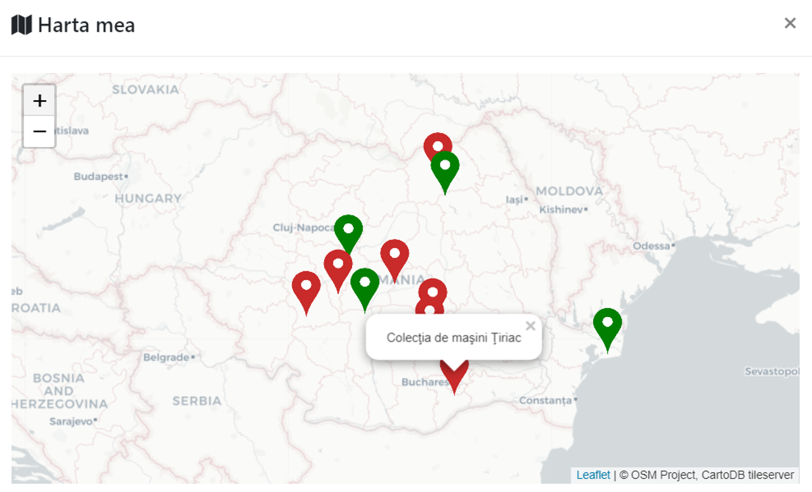

# Explore¹⁰⁰
Consider că cel mai bun mod de a învăța este cel care îl solicită pe receptorul informației și îi oferă o satisfacție pe cât posibil imediată. Astfel, am creat platforma Explore100 – aceasta are ca scop promovarea istoriei dar și a punctelor curente de atracție din România, totodată încurajând utilizatorul să le viziteze în realitate – un dispozitiv construit special în acest scop urmărește progresul utilizatorului cu GPS și îi oferă puncte când vizitează fizic locațiile de interes de pe teritoriul țării.
## Cerințe de sistem
Server & aplicație:
  - NodeJS & NPM
  - Electron

URL pentru acces in afara wrapper-ului: http://localhost:8080
Microcontroller (pentru a asambla):
  - Platformă compatibilă Arduino
  - Modul comunicare WiFi ESP8266
  - Display OLED I2C compatibil SSD1306
  - Display digit TM1637
  - Ublox NEO-6M GPS
  - Diferite LED-uri, rezistențe, 2 butoane, jumper wires

Ambele/altele (pentru a programa și rula/folosi):
  - O rețea wifi pentru interconectarea componentelor
  - Un calculator cu Arduino IDE și driverele necesare
## Instalare
Server & aplicație:
    `npm install`
    `node server.js`
Cod microcontroller:
- Se modifică parametrii _SSID,PASS,url_ să corespunză cu credențialele rețelei WiFi dorite, și url să corespundă cu IP-ul calculatorului care găzduiește API-ul, respectiv portul pe care ascultă Express.

### Proiect
* [Documentație](Infoeducatie.pdf) - Descarcă PDF

#### Known Bugs
Momentan am ales protocolul HTTP pentru: simplificarea deploymentului pe un URL invalid (localhost) si dezvoltarea unei conexiuni cu placuta ESP8266, pe care verificarea certificatelor aferente SSL trebuie implementata manual si in lipsa unui ceas integrat. _Este pe lista de imbunatatiri pentru acest sistem._